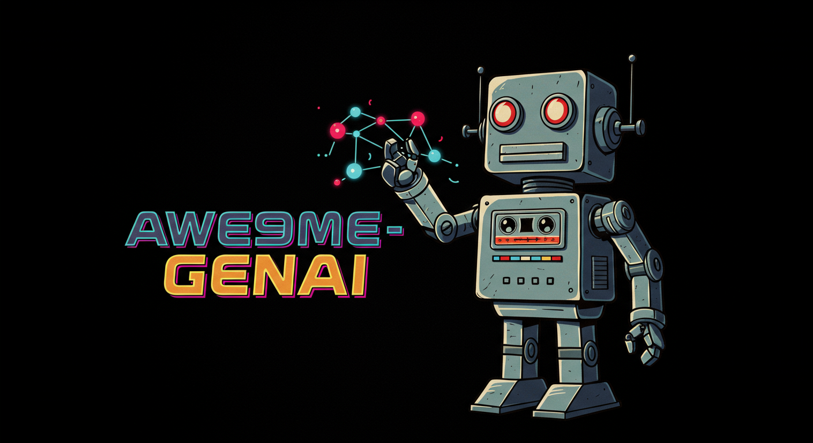

# Awesome GenAI

## Models
- Gemini
- Veo
- Gemma
- Claude

## Demo
- [Media Gen](./media-gen)
- [Realtime Reputation Defender](./rrd-graph/)
- [Trend Spotting](./trendspotting/)
- [Play Farkle with Gemini](./farkle)
- [Story Gen](./story-gen)

## Quick Start - RRD Nexus

To run the RRD Nexus application (job management service):

**From project directory (Recommended):**
```bash
cd rrd-graph
uv run python run_nexus.py
```

**Direct from app directory:**
```bash
cd rrd-graph/apps/nexus
uv run uvicorn main:fapp --host 0.0.0.0 --port 8000
```

**From root directory (requires rrd-graph setup):**
```bash
# First ensure rrd-graph dependencies are installed
cd rrd-graph && uv sync
cd ..
uv run python run_nexus.py
```