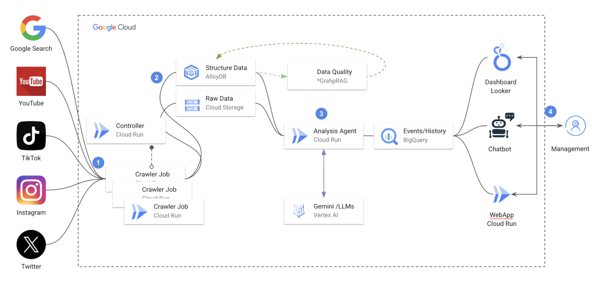

# Realtime Reputation Defender

## Description 
Instantly understand how your brand or an event is perceived across all major online platforms worldwide. The built-in playbook provides expert guidance and supports automated engagement to help you quickly address and resolve issues.

## System diagram




 [1] Source data collecting by provisioning Cloud Run Jobs by control plane.

 [2] RAG service to further process in order to have a high quality of data for sentiment.

 [3] Batch prediction for high performance sentiment analysis.

 [4] Cloud Run for webUI and Looker/Open Source as the major component for dashboard (no Looker for current edition) 


## Deployment

```sh
export PYTHONPATH=../
```


## Ideas 

- Provide a webbook to monitoring converstation in any chat space and provide realtime report.
- Act as moderation bot, which is aim to a realhuman, sentiment conversation in the chat group and deescalate toxic conversations.


## License